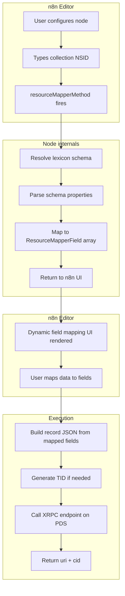
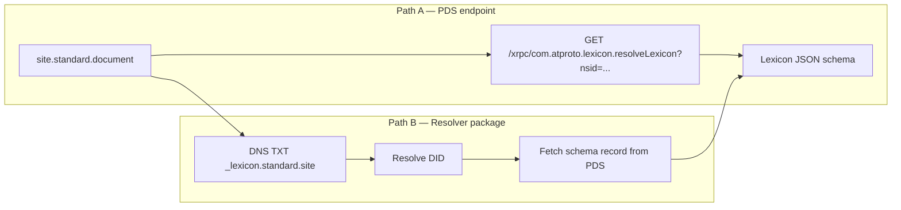
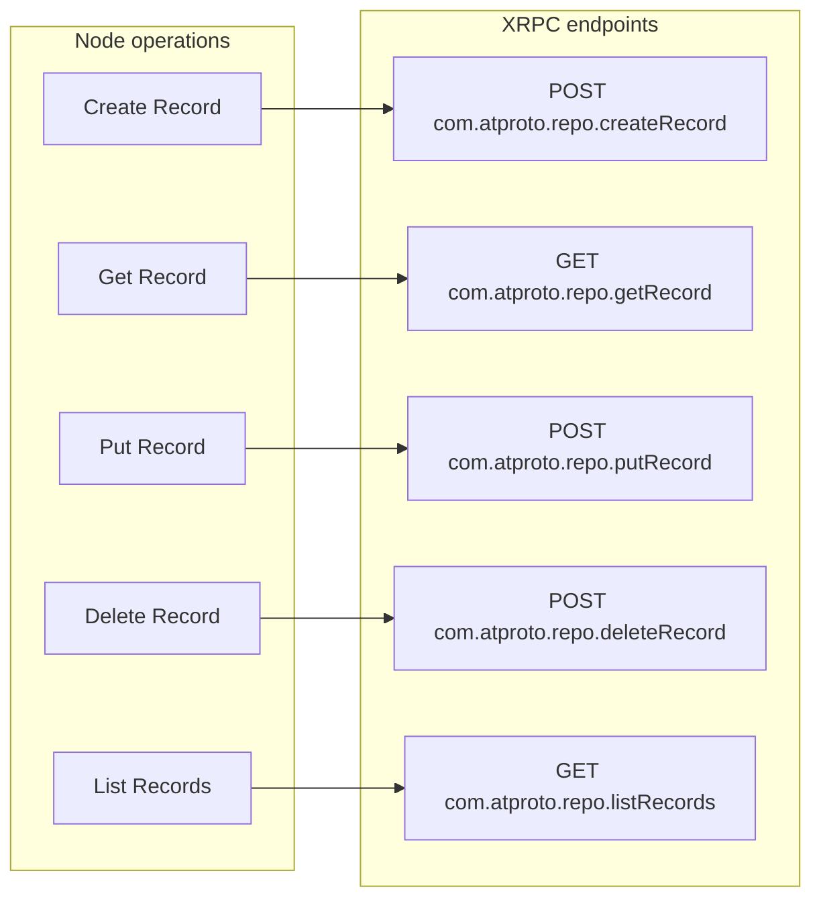
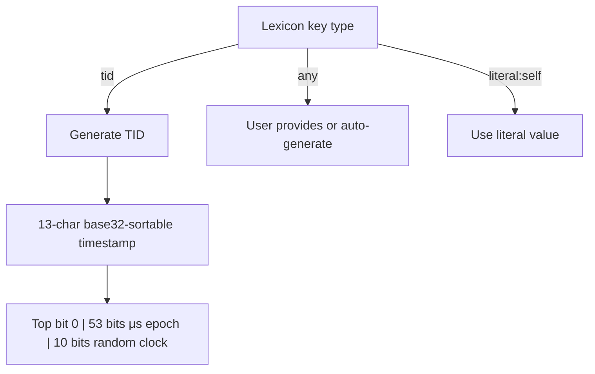
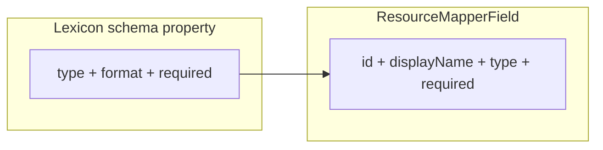
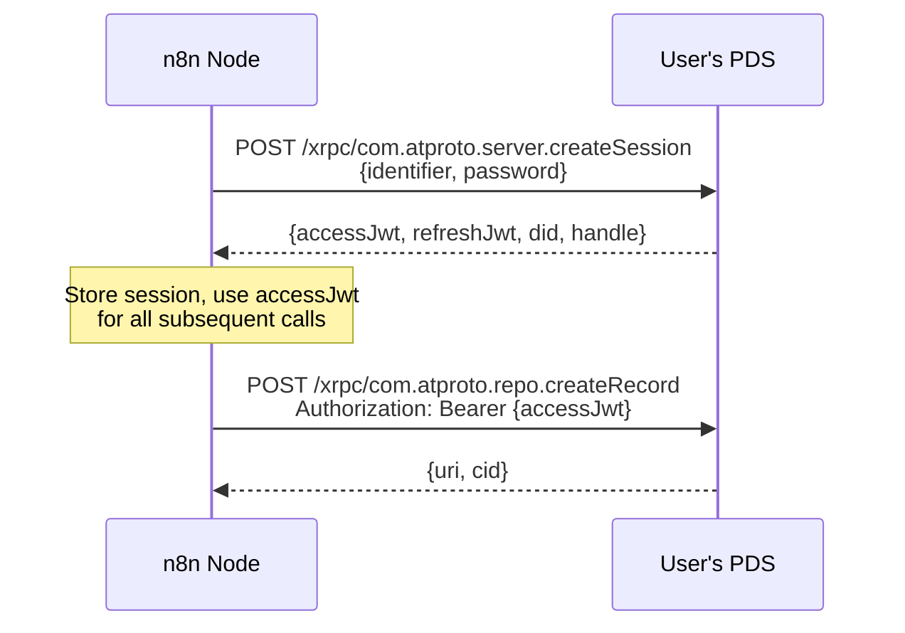

# Design

## Overview

A single n8n community node that wraps the five generic AT Protocol record operations and uses lexicon resolution to present dynamic, schema-aware form fields in the n8n editor.

The node knows nothing about specific lexicons at build time. All schema knowledge comes from the network at configuration time.

## Architecture



## Lexicon Resolution

Two paths to resolve a lexicon schema from an NSID:



**Path A** is simpler — a single authenticated GET to the user's own PDS. Use this as the primary approach. Path B (via `@atproto/lexicon-resolver`) is a fallback for cases where the PDS doesn't support the `resolveLexicon` endpoint yet.

**Caching:** Lexicon schemas rarely change. The `resourceMapperMethod` is called during node configuration in the editor, not on every workflow execution. No runtime resolution penalty.

## Operations

All five map 1:1 to `com.atproto.repo.*` XRPC procedures:



### Input parameters per operation

| Parameter | Create | Get | Put | Delete | List |
|-----------|--------|-----|-----|--------|------|
| Collection (NSID) | ✓ | ✓ | ✓ | ✓ | ✓ |
| Repo (DID/handle) | default: self | optional (default: self) | default: self | default: self | optional (default: self) |
| Record Key | auto/custom | ✓ | ✓ | ✓ | — |
| Record data (mapped fields) | ✓ | — | ✓ | — | — |
| Swap Record (CID) | — | — | optional | — | — |
| Limit | — | — | — | — | ✓ |
| Cursor | — | — | — | — | ✓ |

**Repo parameter:** Defaults to the authenticated user's DID. Get and List accept an optional repo field to read other users' public records. Write operations (Create, Put, Delete) always use the authenticated user's repo.

### Output

All write operations return `{ uri, cid }`. Get returns the full record. List returns a single page of records with a cursor for pagination. Users chain nodes or loop to paginate further.

### `$type` injection

The node auto-injects `$type` into every record, set to the collection NSID. Users never need to provide it.

### Put semantics

`putRecord` is a **full replace**, not a merge. The user must provide the complete record. An optional `swapRecord` field accepts a CID for optimistic concurrency control — the PDS will reject the put if the current record's CID doesn't match.

## Record Key Generation

AT Protocol record keys follow one of three strategies, declared in the lexicon schema's `key` field:



The node defaults to TID generation. Users can override with a custom key via a dropdown.

## Field Mapping: Lexicon → n8n

The `resourceMapperMethod` transforms a lexicon record schema into n8n `ResourceMapperField[]`:



### Type mapping

| Lexicon type | Lexicon format | n8n FieldType |
|-------------|----------------|---------------|
| `string` | — | `string` |
| `string` | `datetime` | `dateTime` |
| `string` | `uri` | `string` |
| `string` | `at-uri` | `string` |
| `string` | `did` | `string` |
| `integer` | — | `number` |
| `boolean` | — | `boolean` |
| `array` | — | `json` |
| `object` | — | `json` |
| `union` | — | `json` |
| `ref` | — | `json` |
| `blob` | — | `string` (binary property name) |
| `cid-link` | — | `string` |
| `bytes` | — | `string` |

Complex types (`object`, `union`, `ref`, `array`) render as JSON fields. The user pastes or builds JSON via expressions. Simple types get native n8n inputs.

**Special handling:**
- **Single-ref unions** (e.g. `{ type: "union", refs: ["site.standard.theme.color#rgb"] }`) are resolved and flattened like regular refs.
- **RGB color objects** (objects with exactly `r`, `g`, `b` integer properties) collapse to a single hex string field (`#3B82F6`) instead of three number fields.
- **Multi-ref unions** show the valid `$type` options in the field label.
- **Arrays** show the item type in the field label.
- **Blob fields** include a hint that the value should be a binary property name from the input.

### Recursive `ref` resolution

When a field references another schema (e.g. `app.bsky.richtext.facet`), the node resolves the referenced schema and renders nested typed fields rather than falling back to a raw JSON input. This provides a better UX for complex record types. Resolution follows the same PDS endpoint → fallback chain as the top-level schema.

**Type-only lexicons** (lexicons with no main record, only named type definitions like `site.standard.theme.color`) are supported — `resolveLexiconSchema` returns a defs-only schema so cross-document fragment resolution (e.g. `#rgb`) works.

### Execution-time processing

After the user's field values are collected and un-flattened into nested objects, the execution pipeline runs:

1. **Blob upload** — binary property names → blob references via `uploadBlob`
2. **Nested `$type` injection** — walks the record + schema and injects `$type` on objects from refs/unions. Hex color strings are expanded to `{ $type, r, g, b }`.
3. **Schema validation** — checks required fields, type correctness, `$type` discriminators, and blob references. Errors are surfaced as bullet-point lists before the PDS call.
4. **`$type` + `createdAt` injection** — top-level auto-injection in `operations.ts`.
5. **XRPC call** — send to PDS.

### Required fields

The `required` array in the lexicon schema maps directly to `required: true` on the `ResourceMapperField`. n8n shows these as mandatory in the field mapping UI.

## Authentication Flow



Handled by `@atproto/api`'s `CredentialSession` + `AtpAgent`, identical to the existing Bluesky n8n node.

### Session lifecycle

The node calls `session.login()` on every workflow execution. Within a single execution, `CredentialSession` automatically handles token refresh if the `accessJwt` expires mid-batch (e.g. during a large loop). No cross-execution caching — n8n's `getWorkflowStaticData` is unreliable and doesn't work in manual test mode, and the overhead of one `createSession` call per execution is negligible for app passwords.

## Dependencies

### Runtime

| Package | Purpose |
|---------|---------|
| `@atproto/api` | Auth (`CredentialSession`), session management (token refresh, persistence), XRPC calls, DID/PDS resolution |
| `@atproto/lexicon-resolver` | Fallback lexicon resolution via DNS when PDS doesn't support `resolveLexicon`. Installed from Phase 1, used in Phase 2. Deps: `@atproto/lex`, `@atproto/lex-document`, `@atproto/repo`, `@atproto/syntax`, `@atproto/identity`, `@atproto-labs/fetch-node` (only `@atproto/syntax` shared with `@atproto/api`) |

### Peer

| Package | Purpose |
|---------|---------|
| `n8n-workflow` | n8n type definitions (`INodeType`, `ResourceMapperField`, etc.) — provided by n8n at runtime |

### Dev

| Package | Purpose |
|---------|---------|
| `typescript` ~5.x | Build (tsc + shell cp for icon — no gulp) |
| `@n8n/node-cli` ≥0.32.0 | Build + provenance for npm publish |
| `oxlint` | Linting (Rust-native, runs n8n plugin via jsPlugins alpha — fallback: eslint for n8n rules) |
| `oxfmt` | Formatting (separate package, Prettier-compatible, `.oxfmtrc.json`) |
| `@n8n/eslint-plugin-community-nodes` | n8n-specific lint rules (loaded as oxlint JS plugin; eslint fallback) |
| `vitest` | Test runner (ESM-native, TypeScript zero-config) |
| `msw` or similar | Mock XRPC server for tests |

No image processing, no OG scraping, no rich text parsing. The node is deliberately thin — it speaks the protocol and defers everything else to the lexicon schema and the user's field mappings.

## File Structure

```
n8n-nodes-atproto/
├── src/
│   ├── credentials/
│   │   └── AtprotoApi.credentials.ts   # Handle, app password, service URL
│   └── nodes/
│       └── Atproto/
│           ├── Atproto.node.ts         # Main node: description + execute()
│           ├── operations.ts           # CRUD operation logic
│           ├── lexicon.ts              # Resolve + parse lexicon schemas
│           ├── fieldMapping.ts         # Lexicon schema → ResourceMapperField[]
│           ├── typeInjection.ts        # Nested $type injection + hex expansion
│           ├── validation.ts           # Pre-submission schema validation
│           ├── blob.ts                 # Blob upload for binary fields
│           ├── tid.ts                  # TID generation
│           └── atproto.svg             # Node icon
├── tests/
├── scripts/
│   └── patch-node-js-exports.mjs       # postinstall: fix uint8arrays for dev
├── package.json
├── tsconfig.json
├── vite.config.build.ts                # Vite library mode build config
├── vitest.config.ts
├── README.md
├── CONTRIBUTING.md
├── DESIGN.md
└── PLAN.md
```

Files live under `src/`. `n8n-node dev` watches and hot-reloads. `vite build` bundles everything into `dist/` with zero runtime dependencies.

## Phasing

### Phase 1 — Generic CRUD with JSON input

The node works as a generic AT Protocol client. Users type a collection NSID and provide record data as raw JSON. Auth, TID generation, and PDS routing are handled automatically.

This is already useful — it replaces manual HTTP Request nodes for any AT Protocol workflow.

### Phase 2 — Dynamic field mapping via lexicon resolution

Add `resourceMapping` support. The node resolves the lexicon schema for the entered NSID and renders typed form fields dynamically. Users map incoming data to named, typed fields instead of crafting JSON by hand.

**Lexicon resolution fallback:** Try the PDS endpoint (`com.atproto.lexicon.resolveLexicon`) first. If it fails (unsupported PDS, network error, unpublished schema), show a warning in the UI and fall back to raw JSON input. `@atproto/lexicon-resolver` is a candidate second path before the JSON fallback.

**Recursive refs:** Fields that reference other schemas are resolved recursively to provide typed sub-fields rather than raw JSON inputs.

### Phase 3 — Blob support

Handle `blob`-typed fields. Accept a binary property name, call `com.atproto.repo.uploadBlob`, and inject the blob reference into the record automatically.

## Testing Strategy

**Automated tests:** Mock XRPC server (using msw or similar). Covers TID generation, field mapping, request construction, `$type` injection, error handling, and pagination logic.

**Manual testing:** Run the node against real Bluesky during development to validate that constructed records are accepted by a real PDS.

**Docker integration tests:** Deferred. Will add a local PDS Docker setup after Phase 1 ships if edge cases warrant it.
